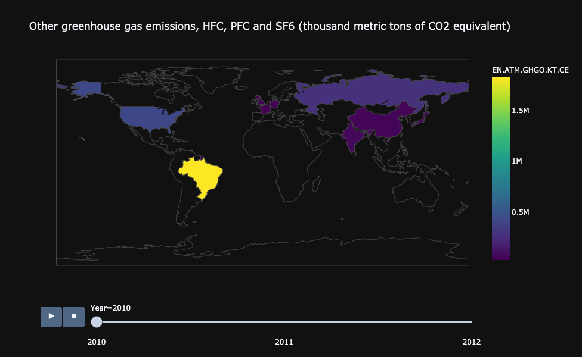
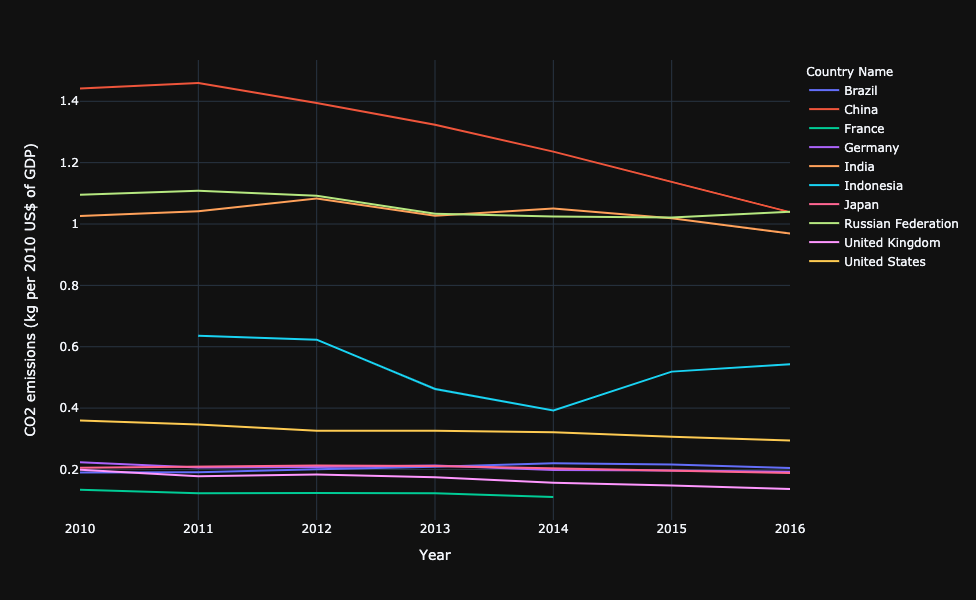
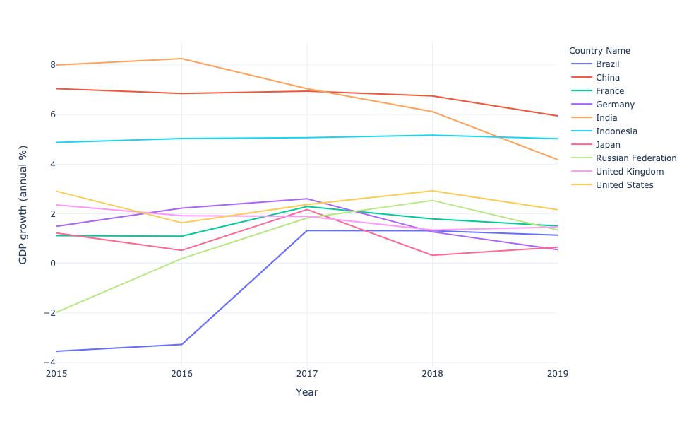
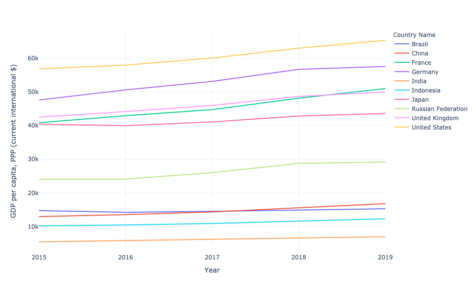
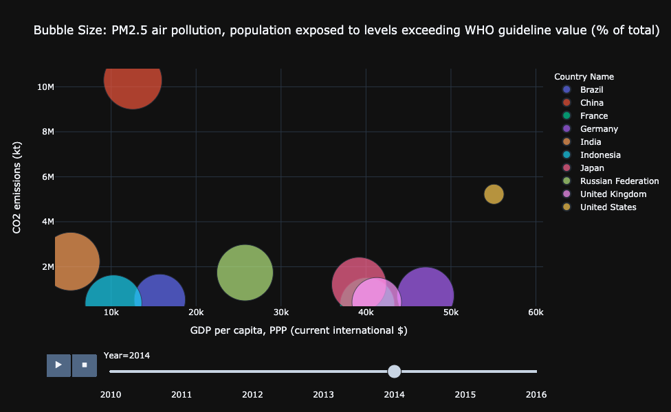

# "ARE WORLD'S TOP ECONOMIES CAUSING THE MOST CLIMATE CHANGE?"

#### In my analysis, I am trying to make observations using the world bank data that "developed and developing countries" were the contributors of climate change during the time span 2010 to 2018. For this analysis, I used World Bank Development Indicators (WDI) and the dataset is provided by World bank at https://data.worldbank.org/

#### I am using the world development explorer developed by 

              "Wang, C. (2021). The world development explorer. Available from http://www.worlddev.xyz"

#### Now let us understand what exactly is climate change? what are its indicators?

#### According to NASA, climate change is caused by a phenomenon called global warming. The causes for global warming are "not" definitely because of the below reasons.Since 1750, the average amount of energy coming from the Sun either remained constant or increased slightly.

#### If the warming were caused by a more active Sun, then scientists would expect to see warmer temperatures in all layers of the atmosphere. Instead, they have observed a cooling in the upper atmosphere, and a warming at the surface and in the lower parts of the atmosphere. That's because greenhouse gases are trapping heat in the lower atmosphere.Climate models that include solar irradiance changes can’t reproduce the observed temperatures.

### Then what is causing climate change?

#### Certain gases like water vapour, carbon dioxide, methane, nitrous oxide and other chloroflourocarbons block the heat in the atmosphere from escaping. These gases trap the heat and this process is resulting in climate change!

#### Alright, but whats the big deal?

#### Effects of climate change i.e increasing land and atmospheric temperatures could most definitely result in extreme weather events around the globe namely,

#### Lengthend frost-free/growing season Changes in precipitation patterns More droughts and heat waves Intense Hurricanes Increase in sea level Ice-free arctic region and certain regional effects

#### For my analysis, I have chosen some relevant climate change indicators and also Economic growth indicators. Let us see if there is any corelation between "countries causing the most climate change" and "world's top economies" during the time span 2010-2018.

**Set of most useful climate change indicators for my analysis are**

1. CO2 Emissions
2. Other GHG'S Emissions
3. CO2 Emissions equivalent to GDP.

**Set of insightful economic growth indicators for my analysis are**

1. GDP
2. GDP growth
3. GNI 

#### To proceed further, let us initially choose top 10 economies of the world according to the UN being CHINA, USA, INDIA, JAPAN, GERMANY, RUSSIA, INDONESIA, BRAZIL, UK, FRANCE.

**According to this figure, China, US, India, Russia, Japan, Germany, Indonesia has the highest co2 emmissions from the time span 2010 -2016 (2017,2018 data unavilable).**

**According to this figure, Brazil, US, Germany, India, Japan, Indonesia, Russsia and others respectively were highest contributors of other Green house gases in the time span of 2 years. 2010 to 2012.**

**According to this figure which talks about the kg per us$ equivalent of gdp, China, Russia, India, Indonesia, US, Brazil and other countries were highest contributors of Co2 gas from the time span 2010-2016.**

**According to this figure, Japan, Indonesia, India, United states, France and others had the highest GDP growth from 2010 to 2019.**

**According to this figure, US, China, India, Japan and the rest had highest GDP ratesfrom 2010 to 2018.**

**According to this figure, some of the world's largest economies are the countries that have the highest air-pollution levels!**

## *CONCLUSION:*

## These 6 charts are indicative of the below conclusion:

## *"During the time span 2010-2018, according to the GDP line charts in this project, the world's top economies were United states, China, India, Brazil, Russia, Germany, Japan, UK, France, Indonesia. Shockingly, the same countries caused the most CO2 and GHG emissions during the same time span."*

### Note: I would like to acknowledge a point here, "Corelation is not causation". There might be several other factors that indicate exact causation for climate change. But here is my effort in showing that we cannot for sure neglect the fact that developing/developed countries with stable economies are a huge part of Global warming and climate change.
# Thankyou!

#### **Citations:** 
**(World development explorer tool by "Wang, C. (2021). The world development explorer. Available from http://www.worlddev.xyz")**
